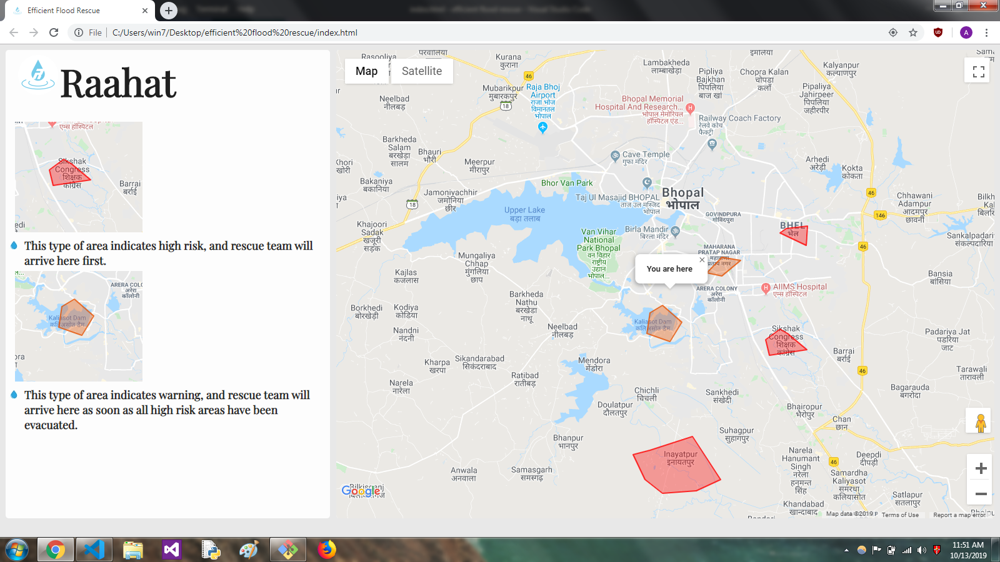
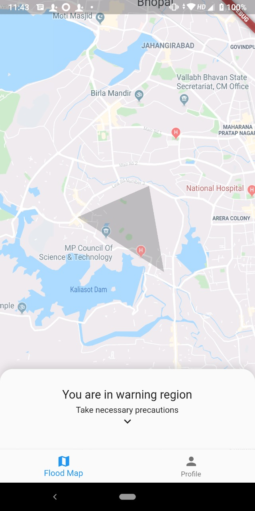
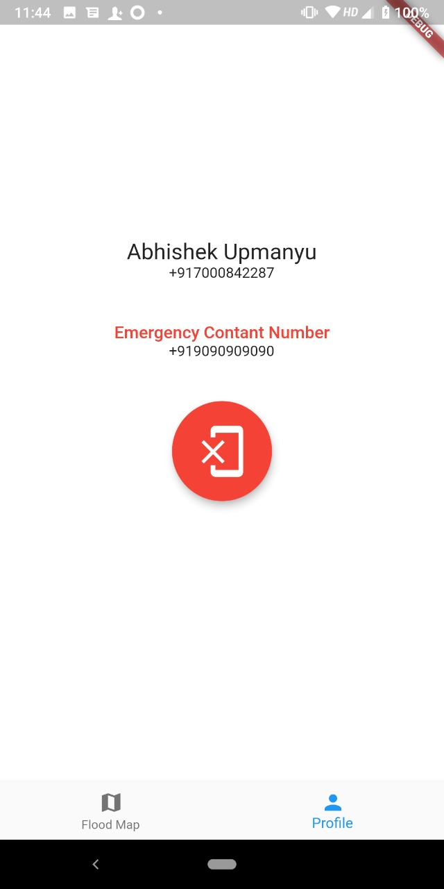
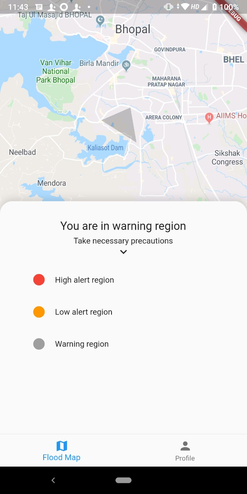

# Raahat
During monsoon, a lot of areas in India get flood affected each year. To minimize the loss of life and property, we created the service 'Raahat'.

Raahat uses Google Maps API and warns users about potential flooding areas. It classifies areas into high and low risk areas based in the elevation. Using this, aid can reach most affected people first. This app also stores an emergency contact number, so that when the user is in high risk area, it could send SMS alerts to that number.
## Screenshots
### Web Version

### Mobile Version

